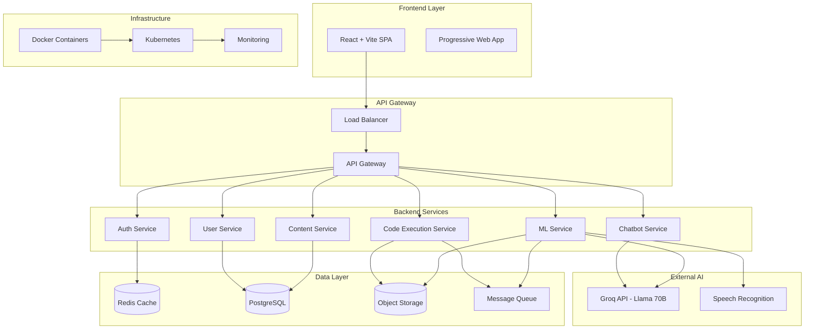

# Design Document

## Overview

PlacementPrep is a cloud-native, AI-powered placement preparation platform built with modern web technologies and scalable architecture. The system combines a React+Vite frontend with a FastAPI backend, integrated ML operations, and advanced AI capabilities through Groq API with Llama 70B model.

The platform provides comprehensive preparation modules including aptitude tests, communication coaching, technical coding challenges, resume analysis, mock interviews, and an intelligent AI chatbot assistant. The architecture is designed for horizontal scaling, high availability, and production workloads.

## Architecture

### High-Level Architecture



### Technology Stack

**Frontend:**
- React 18 with TypeScript for component-based UI
- Vite for fast development and optimized builds
- Tailwind CSS for responsive design
- React Query for state management and API caching
- Socket.io client for real-time features

**Backend:**
- FastAPI with Python 3.11+ for high-performance APIs
- Pydantic for data validation and serialization
- SQLAlchemy ORM with PostgreSQL database
- Redis for caching and session management
- Celery with Redis broker for background tasks

**AI & ML:**
- Groq API integration for Llama 70B model access
- Whisper/Vosk for speech-to-text processing
- spaCy for natural language processing
- Custom ML pipeline for code analysis and scoring

**Infrastructure:**
- Docker containers for service isolation
- Kubernetes for orchestration and scaling
- NGINX for load balancing and reverse proxy
- AWS S3/MinIO for file storage
- Prometheus + Grafana for monitoring

## Components and Interfaces

### Frontend Components

#### Core Application Structure
```typescript
// App component hierarchy
App
├── AuthProvider
├── Router
│   ├── PublicRoutes
│   │   ├── Landing
│   │   ├── Login
│   │   └── Register
│   └── ProtectedRoutes
│       ├── Dashboard
│       ├── AptitudeModule
│       ├── CodingModule
│       ├── CommunicationModule
│       ├── ResumeModule
│       ├── MockInterviewModule
│       ├── LeaderboardModule
│       └── ChatbotWidget
└── GlobalProviders
    ├── ThemeProvider
    ├── NotificationProvider
    └── SocketProvider
```

#### Key Component Interfaces
```typescript
interface User {
  id: string;
  email: string;
  name: string;
  role: 'student' | 'trainer' | 'admin';
  profile: UserProfile;
  progress: ProgressMetrics;
}

interface TestSession {
  id: string;
  type: 'aptitude' | 'coding' | 'communication';
  questions: Question[];
  timeLimit: number;
  startTime: Date;
  submissions: Submission[];
}

interface ChatMessage {
  id: string;
  content: string;
  role: 'user' | 'assistant';
  timestamp: Date;
  context?: SessionContext;
}
```

### Backend Services

#### Authentication Service
```python
class AuthService:
    async def register_user(self, user_data: UserCreate) -> User
    async def authenticate_user(self, credentials: UserCredentials) -> TokenResponse
    async def refresh_token(self, refresh_token: str) -> TokenResponse
    async def verify_token(self, token: str) -> User
```

#### Content Management Service
```python
class ContentService:
    async def get_questions(self, filters: QuestionFilters) -> List[Question]
    async def create_test_session(self, test_config: TestConfig) -> TestSession
    async def submit_answer(self, submission: SubmissionCreate) -> SubmissionResult
    async def get_leaderboard(self, category: str, filters: dict) -> Leaderboard
```

#### Code Execution Service
```python
class CodeExecutionService:
    async def execute_code(self, code: str, language: str, test_cases: List[TestCase]) -> ExecutionResult
    async def validate_solution(self, submission: CodeSubmission) -> ValidationResult
    async def get_execution_metrics(self, execution_id: str) -> ExecutionMetrics
```

#### ML Service
```python
class MLService:
    async def process_audio(self, audio_file: UploadFile) -> TranscriptionResult
    async def analyze_communication(self, transcript: str) -> CommunicationAnalysis
    async def analyze_resume(self, resume_file: UploadFile) -> ResumeAnalysis
    async def generate_feedback(self, performance_data: dict) -> FeedbackReport
```

#### Chatbot Service
```python
class ChatbotService:
    async def process_message(self, message: str, context: SessionContext) -> ChatResponse
    async def get_coding_help(self, code: str, error: str) -> CodingAssistance
    async def explain_concept(self, topic: str, difficulty: str) -> ConceptExplanation
    async def maintain_conversation_context(self, session_id: str) -> ConversationState
```

### External API Integrations

#### Groq API Integration
```python
class GroqAPIClient:
    def __init__(self, api_key: str, model: str = "llama-70b-8192"):
        self.client = Groq(api_key=api_key)
        self.model = model
    
    async def generate_response(self, messages: List[dict], max_tokens: int = 1000) -> str
    async def analyze_code(self, code: str, language: str) -> CodeAnalysis
    async def provide_explanation(self, question: str, context: str) -> Explanation
```

## Data Models

### Core Entities

#### User Management
```python
class User(BaseModel):
    id: UUID
    email: EmailStr
    name: str
    role: UserRole
    created_at: datetime
    last_login: Optional[datetime]
    is_active: bool = True

class UserProfile(BaseModel):
    user_id: UUID
    college: Optional[str]
    graduation_year: Optional[int]
    target_companies: List[str]
    preferred_roles: List[str]
    skill_levels: Dict[str, int]
```

#### Content Management
```python
class Question(BaseModel):
    id: UUID
    type: QuestionType  # aptitude, coding, communication
    category: str
    difficulty: DifficultyLevel
    content: str
    options: Optional[List[str]]
    correct_answer: str
    explanation: Optional[str]
    company_tags: List[str]
    topic_tags: List[str]

class TestSession(BaseModel):
    id: UUID
    user_id: UUID
    test_type: TestType
    configuration: TestConfig
    start_time: datetime
    end_time: Optional[datetime]
    status: SessionStatus
    score: Optional[float]
```

#### Submissions and Results
```python
class Submission(BaseModel):
    id: UUID
    session_id: UUID
    question_id: UUID
    user_answer: str
    is_correct: bool
    time_taken: int  # seconds
    submitted_at: datetime

class CodeSubmission(Submission):
    language: str
    code: str
    test_results: List[TestCaseResult]
    execution_time: float
    memory_usage: int

class CommunicationSubmission(Submission):
    audio_file_url: str
    transcript: str
    analysis: CommunicationAnalysis
```

#### AI and ML Models
```python
class ChatConversation(BaseModel):
    id: UUID
    user_id: UUID
    session_id: Optional[UUID]
    messages: List[ChatMessage]
    context_type: str  # coding, aptitude, general
    created_at: datetime
    updated_at: datetime

class MLAnalysisResult(BaseModel):
    id: UUID
    submission_id: UUID
    analysis_type: str
    confidence_score: float
    results: Dict[str, Any]
    processing_time: float
    model_version: str
```

### Database Schema Design

#### PostgreSQL Tables
```sql
-- Core user management
CREATE TABLE users (
    id UUID PRIMARY KEY DEFAULT gen_random_uuid(),
    email VARCHAR(255) UNIQUE NOT NULL,
    name VARCHAR(255) NOT NULL,
    password_hash VARCHAR(255) NOT NULL,
    role VARCHAR(50) NOT NULL,
    created_at TIMESTAMP DEFAULT NOW(),
    last_login TIMESTAMP,
    is_active BOOLEAN DEFAULT TRUE
);

-- Question bank with full-text search
CREATE TABLE questions (
    id UUID PRIMARY KEY DEFAULT gen_random_uuid(),
    type VARCHAR(50) NOT NULL,
    category VARCHAR(100) NOT NULL,
    difficulty INTEGER NOT NULL,
    content TEXT NOT NULL,
    options JSONB,
    correct_answer TEXT NOT NULL,
    explanation TEXT,
    company_tags TEXT[],
    topic_tags TEXT[],
    created_at TIMESTAMP DEFAULT NOW(),
    updated_at TIMESTAMP DEFAULT NOW()
);

CREATE INDEX idx_questions_search ON questions USING GIN(to_tsvector('english', content));
CREATE INDEX idx_questions_tags ON questions USING GIN(company_tags, topic_tags);

-- Test sessions and performance tracking
CREATE TABLE test_sessions (
    id UUID PRIMARY KEY DEFAULT gen_random_uuid(),
    user_id UUID REFERENCES users(id),
    test_type VARCHAR(50) NOT NULL,
    configuration JSONB NOT NULL,
    start_time TIMESTAMP NOT NULL,
    end_time TIMESTAMP,
    status VARCHAR(50) NOT NULL,
    score DECIMAL(5,2),
    created_at TIMESTAMP DEFAULT NOW()
);

-- Submissions with polymorphic design
CREATE TABLE submissions (
    id UUID PRIMARY KEY DEFAULT gen_random_uuid(),
    session_id UUID REFERENCES test_sessions(id),
    question_id UUID REFERENCES questions(id),
    submission_type VARCHAR(50) NOT NULL,
    user_answer TEXT NOT NULL,
    is_correct BOOLEAN,
    time_taken INTEGER,
    metadata JSONB,
    submitted_at TIMESTAMP DEFAULT NOW()
);
```

## Error Handling

### Error Classification and Response Strategy

#### Client-Side Error Handling
```typescript
class ErrorHandler {
  static handleAPIError(error: AxiosError): UserFriendlyError {
    switch (error.response?.status) {
      case 400:
        return new ValidationError(error.response.data.detail);
      case 401:
        return new AuthenticationError("Please log in again");
      case 403:
        return new AuthorizationError("Access denied");
      case 429:
        return new RateLimitError("Too many requests, please try again later");
      case 500:
        return new ServerError("Something went wrong, please try again");
      default:
        return new NetworkError("Connection failed");
    }
  }
}
```

#### Backend Error Handling
```python
class CustomException(Exception):
    def __init__(self, message: str, error_code: str, status_code: int = 400):
        self.message = message
        self.error_code = error_code
        self.status_code = status_code

class ValidationError(CustomException):
    def __init__(self, message: str):
        super().__init__(message, "VALIDATION_ERROR", 400)

class ExternalServiceError(CustomException):
    def __init__(self, service: str, message: str):
        super().__init__(f"{service} service error: {message}", "EXTERNAL_SERVICE_ERROR", 503)

@app.exception_handler(CustomException)
async def custom_exception_handler(request: Request, exc: CustomException):
    return JSONResponse(
        status_code=exc.status_code,
        content={
            "error": exc.error_code,
            "message": exc.message,
            "timestamp": datetime.utcnow().isoformat()
        }
    )
```

### Resilience Patterns

#### Circuit Breaker for External APIs
```python
class CircuitBreaker:
    def __init__(self, failure_threshold: int = 5, timeout: int = 60):
        self.failure_threshold = failure_threshold
        self.timeout = timeout
        self.failure_count = 0
        self.last_failure_time = None
        self.state = "CLOSED"  # CLOSED, OPEN, HALF_OPEN
    
    async def call(self, func, *args, **kwargs):
        if self.state == "OPEN":
            if time.time() - self.last_failure_time > self.timeout:
                self.state = "HALF_OPEN"
            else:
                raise ExternalServiceError("groq", "Service temporarily unavailable")
        
        try:
            result = await func(*args, **kwargs)
            if self.state == "HALF_OPEN":
                self.state = "CLOSED"
                self.failure_count = 0
            return result
        except Exception as e:
            self.failure_count += 1
            self.last_failure_time = time.time()
            if self.failure_count >= self.failure_threshold:
                self.state = "OPEN"
            raise e
```

## Testing Strategy

### Testing Pyramid

#### Unit Tests (70%)
```python
# Example unit test for ML service
class TestMLService:
    @pytest.fixture
    def ml_service(self):
        return MLService()
    
    @pytest.mark.asyncio
    async def test_analyze_communication_valid_transcript(self, ml_service):
        transcript = "Hello, my name is John and I am excited about this opportunity."
        result = await ml_service.analyze_communication(transcript)
        
        assert result.confidence_score > 0.7
        assert result.grammar_score >= 0.8
        assert "filler_words" in result.metrics
        assert result.suggestions is not None

    @pytest.mark.asyncio
    async def test_code_execution_timeout_handling(self, ml_service):
        infinite_loop_code = "while True: pass"
        
        with pytest.raises(ExecutionTimeoutError):
            await ml_service.execute_code(infinite_loop_code, "python", timeout=5)
```

#### Integration Tests (20%)
```python
class TestAPIIntegration:
    @pytest.mark.asyncio
    async def test_complete_test_session_flow(self, client, test_user):
        # Create test session
        session_response = await client.post(
            "/api/v1/sessions",
            json={"test_type": "aptitude", "category": "logical_reasoning"},
            headers={"Authorization": f"Bearer {test_user.token}"}
        )
        session_id = session_response.json()["id"]
        
        # Submit answers
        for question in session_response.json()["questions"]:
            await client.post(
                f"/api/v1/sessions/{session_id}/submit",
                json={"question_id": question["id"], "answer": "A"}
            )
        
        # Complete session
        result = await client.post(f"/api/v1/sessions/{session_id}/complete")
        
        assert result.status_code == 200
        assert "score" in result.json()
        assert "feedback" in result.json()
```

#### End-to-End Tests (10%)
```typescript
// Playwright E2E test
test('Complete coding challenge workflow', async ({ page }) => {
  await page.goto('/login');
  await page.fill('[data-testid=email]', 'test@example.com');
  await page.fill('[data-testid=password]', 'password123');
  await page.click('[data-testid=login-button]');
  
  await page.goto('/coding');
  await page.click('[data-testid=start-challenge]');
  
  // Write code solution
  await page.fill('[data-testid=code-editor]', 'def solution(nums): return sum(nums)');
  await page.click('[data-testid=run-code]');
  
  // Verify results
  await expect(page.locator('[data-testid=test-results]')).toContainText('All tests passed');
  await page.click('[data-testid=submit-solution]');
  
  await expect(page.locator('[data-testid=success-message]')).toBeVisible();
});
```

### Performance Testing
```python
# Load testing with Locust
class UserBehavior(HttpUser):
    wait_time = between(1, 3)
    
    def on_start(self):
        self.login()
    
    def login(self):
        response = self.client.post("/api/v1/auth/login", json={
            "email": "test@example.com",
            "password": "password123"
        })
        self.token = response.json()["access_token"]
        self.client.headers.update({"Authorization": f"Bearer {self.token}"})
    
    @task(3)
    def browse_questions(self):
        self.client.get("/api/v1/questions?category=aptitude&limit=20")
    
    @task(2)
    def start_test_session(self):
        self.client.post("/api/v1/sessions", json={
            "test_type": "aptitude",
            "category": "logical_reasoning"
        })
    
    @task(1)
    def chat_with_ai(self):
        self.client.post("/api/v1/chat", json={
            "message": "Explain binary search algorithm",
            "context": "coding_help"
        })
```

### Security Testing
```python
class TestSecurity:
    def test_sql_injection_protection(self, client):
        malicious_input = "'; DROP TABLE users; --"
        response = client.get(f"/api/v1/questions?search={malicious_input}")
        assert response.status_code != 500
        # Verify database integrity
    
    def test_xss_protection(self, client):
        xss_payload = "<script>alert('xss')</script>"
        response = client.post("/api/v1/questions", json={
            "content": xss_payload
        })
        # Verify payload is sanitized
    
    def test_rate_limiting(self, client):
        for _ in range(101):  # Exceed rate limit
            response = client.get("/api/v1/questions")
        assert response.status_code == 429
```

This comprehensive design document provides the technical foundation for building a scalable, production-ready placement preparation platform with advanced AI capabilities. The architecture supports horizontal scaling, maintains security best practices, and integrates modern ML operations for intelligent user assistance.